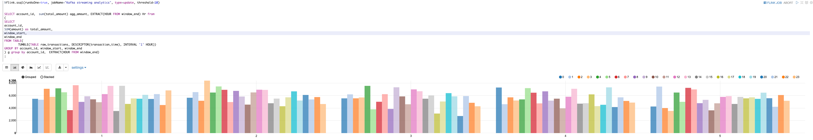

# flink-meetup
Demo code for flink meetup

build and run instructions
build:
`docker-compose build`

note, in case if any issue with build (could not reference previous images built) please try setting 
```
export DOCKER_BUILDKIT=0
export COMPOSE_DOCKER_CLI_BUILD=0
```

run:
`docker-compose up -d`

service-urls:

flink-ui    -   http://localhost:9081
zeppelin-ui -   http://localhost:9080
kafdrop     -   http://localhost:9000

### Demo Details  


#### BASICS
http://localhost:9080/#/notebook/2JUMVSA3G

### 01-Basics & Stream Ingestion

In this section we federate kafka topic data and interact using SQL.

1. create table on top of kafka and read the data
2. create jdbc federation (access objects in a database)
3. Simple data ingestion into Kafka
4. read data from kafka and write into database
5. read data from kafka, transform and write to another topic

### 02-Interactive streaming Analytics

http://localhost:9080/#/notebook/2JUXXT4TU

In this section we federate kafka topic data and perform interactive analytics using SQL.

1. create table on top of kafka and read the data
2. Interactively visualize the data



### 03-Stream Transformations
In this section we federate kafka topic data and interact using SQL.

1. create table on top of kafka and read the data
2. create jdbc federation (access objects in a database)
3. read data from kafka, transform and write into database
4. read data from kafka, transform and write to another topic(Stream ETL)


### Dynamic Rule Engine

Dynamic rule engine enables the capability, detect the match cases, where continuously changing rules a inflow of events.
and perform a certain action based on the rule configuration.

ex 
lets say we want to notify a user when there is an event occurred with attribute `attr1` as `criteria-a`
```json
{
   "id":1,
   "col1":100,
   "attr1":"criteria-a",
   "attr2":"criteria-b"
}
```
we define the rule as 
```json
{
   "rulename":"match1",
   "rulekey":"attr1",
   "rulevalue":"criteria-a",
   "actionid":"100"
}
```

letter we can add more rules or perhaps a updates a existing rule which basically detect the changes.


Use cases:

1. Infra monitoring and action based alerts ( Notfications )
2. Error detection and remediation (process flow ex: retail support) 

```
docker exec -it flink-meetup-kafka-1 bash

#events
echo '{"id":1,"col1":100,"attr1":"criteria-a","attr2":"criteria-b", "attr4":"criteria-x"}' | /opt/kafka/bin/kafka-console-producer.sh --bootstrap-server kafka:9092 --topic event
echo '{"id":1,"col1":100,"attr4":"criteria-c","attr6":"criteria-d"}' | /opt/kafka/bin/kafka-console-producer.sh --bootstrap-server kafka:9092 --topic event

#Rules
#Rule1: 
echo '{"rulename":"match1","rulekey":"attr1","rulevalue":"criteria-a","actionid":"100"}' | /opt/kafka/bin/kafka-console-producer.sh --bootstrap-server kafka:9092 --topic rule
#Rule2
echo '{"rulename":"match2","rulekey":"attr4","rulevalue":"criteria-c","actionid":"200"}' | /opt/kafka/bin/kafka-console-producer.sh --bootstrap-server kafka:9092 --topic rule
echo '{"rulename":"match2","rulekey":"attr6","rulevalue":"criteria-d"}' | /opt/kafka/bin/kafka-console-producer.sh --bootstrap-server kafka:9092 --topic rule

#Update Rule1
#Base Rule
echo '{"rulename":"match3","rulekey":"attr4","rulevalue":"criteria-x","actionid":"100"}' | /opt/kafka/bin/kafka-console-producer.sh --bootstrap-server kafka:9092 --topic rule
#Modification
echo '{"rulename":"match3","rulekey":"attr4","rulevalue":"criteria-c","actionid":"100"}' | /opt/kafka/bin/kafka-console-producer.sh --bootstrap-server kafka:9092 --topic rule

```

